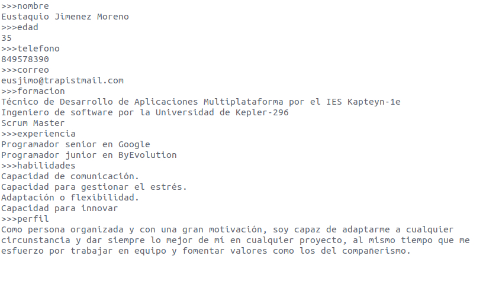
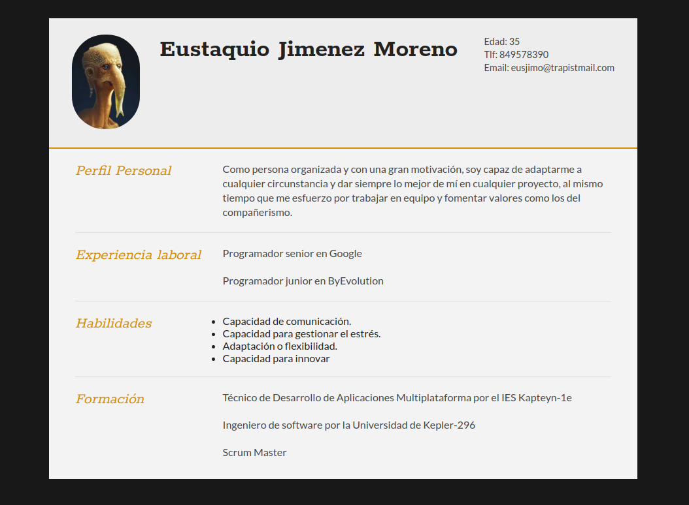

# CV-Gen
Programa que genera un curriculum en html mediante un archivo .txt

# Archivo .txt 
El archivo en el que almacenemos los datos de nuestro curriculum es el siguiente:

# Cv generado en html
Una vez generado el html la vista desde el nevegador sera algo asi:

# Funcionamiento
Básicamente se trata de rellenar el archivo .txt tal y como se muestra en la captura, siempre y cuando respetemos los patrones de la plantilla el funcionamiento será correcto.

Respetar los patrones:
>>>nombre
>>>edad 
>>>telefono
>>>correo
>>>formacion
>>>experiencia
>>>habilidades 
>>>perfil

Si queremos añadir una imagen la imagen deberá ir en la carpeta img  el nobre de la imagen será: img.jpg

